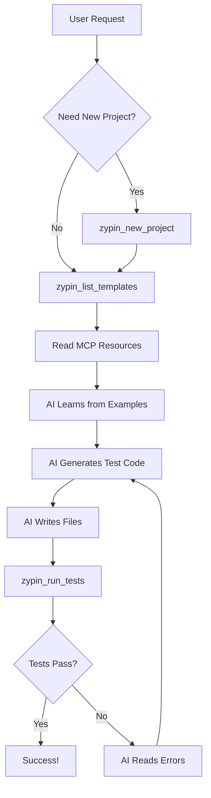

# Zypin MCP Agent Mode - Use Cases

## 📋 Overview

Zypin's MCP (Model Context Protocol) Agent Mode allows AI agents to interact with the testing framework through **24 standardized tools**. This enables AI to autonomously discover, create, execute tests, and inspect websites.

**Available Tools:**
- **3 Zypin Tools:** Project management, template discovery, test execution
- **21 Browser Tools:** Full browser automation powered by Playwright (navigate, click, inspect, screenshot, etc.)

**Architecture:** Single unified MCP server with embedded playwright-mcp via internal client using in-memory transport.

---

## 🎯 Core Philosophy

### **Trust AI Intelligence**
- AI agents are smart enough to learn from examples
- Provide raw materials (examples, source code), not pre-processed data
- Let AI make decisions about test structure and implementation
- Natural error feedback loop (run → error → fix → retry)

### **Configuration Over Code**
- Templates define what files to expose via `package.json`
- Dynamic file loading based on config
- No hardcoded logic for parsing or validation
- Easy to extend without code changes

---

## 🛠️ Available MCP Tools

### **1. `zypin_list_templates`**
**Purpose:** Discover available testing templates

**Input:** None

**Output:**
```json
{
  "templates": [
    {
      "id": "cucumber-bdd",
      "name": "Cucumber BDD for Selenium",
      "type": "e2e-bdd",
      "description": "A template for writing BDD tests in Gherkin syntax with pre-defined Selenium steps.",
      "tags": ["selenium", "cucumber", "bdd", "gherkin", "e2e"]
    },
    {
      "id": "playwright-basic",
      "name": "Basic Playwright",
      "type": "e2e",
      "description": "A starter template for end-to-end browser testing using Playwright.",
      "tags": ["playwright", "browser", "ui", "end-to-end", "e2e"]
    },
    {
      "id": "selenium-basic",
      "name": "Basic Selenium",
      "type": "e2e",
      "description": "A starter template for end-to-end browser testing using Selenium WebDriver.",
      "tags": ["selenium", "webdriver", "browser", "ui", "end-to-end", "e2e"]
    }
  ]
}
```

---

### **2. `zypin_new_project`**
**Purpose:** Create a new test project from a template

**Input:**
```json
{
  "projectName": "my-test-project",
  "template": "playwright-basic"
}
```

**Output:**
```json
{
  "success": true,
  "message": "Project my-test-project created at /path/to/my-test-project"
}
```

**What it does:**
- Copies template files to new directory
- Sets up project structure
- Installs dependencies
- Ready to write tests

---

### **3. `zypin_run_tests`**
**Purpose:** Execute tests in a project

**Input:**
```json
{
  "filePattern": "features/**/*.feature",
  "directory": "/path/to/project"
}
```

**Output:**
```json
{
  "success": true,
  "message": "Tests completed."
}
```

**What it does:**
- Runs tests matching the file pattern
- Executes in specified directory
- Returns test results

---

## 📚 MCP Resources

**Purpose:** Provide access to template example files for AI to learn from

Each template exposes example files via MCP resources:

**Available Resources:**
- `zypin://template/playwright-basic/example` - Basic Playwright test example
- `zypin://template/selenium-basic/example` - Basic Selenium test example
- `zypin://template/cucumber-bdd/example` - Cucumber/Gherkin feature file
- `zypin://template/cucumber-bdd/steps` - 700+ pre-defined step definitions

**How AI Uses Resources:**
1. List templates with `zypin_list_templates`
2. Read example code from resources
3. Learn patterns and import structure
4. Generate new tests following the examples

---

## 🌐 Browser Automation Tools (21 Tools)

**Purpose:** Full browser automation powered by Playwright, integrated via internal MCP client

**Architecture:** Zypin server embeds a playwright-mcp server internally using in-memory transport, making all 21 browser tools available seamlessly.

### **Navigation & Control**
- **`browser_navigate`** - Navigate to URLs
- **`browser_close`** - Close browser windows or tabs
- **`browser_resize`** - Resize browser viewport

### **Element Interaction**
- **`browser_click`** - Click elements by selector
- **`browser_fill`** - Fill input fields
- **`browser_select_option`** - Select dropdown options
- **`browser_hover`** - Hover over elements
- **`browser_drag_and_drop`** - Drag and drop operations
- **`browser_scroll`** - Scroll pages

### **Inspection & Debugging**
- **`browser_get_element`** - Get element details and attributes
- **`browser_console_messages`** - View browser console logs
- **`browser_screenshot`** - Capture page screenshots
- **`browser_evaluate`** - Execute JavaScript in browser context

### **Keyboard Operations**
- **`browser_keyboard_press`** - Press specific keys
- **`browser_keyboard_type`** - Type text with keyboard
- **`browser_keyboard_insert_text`** - Insert text directly

### **Mouse Operations**
- **`browser_mouse_move`** - Move mouse to coordinates
- **`browser_mouse_click`** - Click at coordinates
- **`browser_mouse_dblclick`** - Double click
- **`browser_mouse_wheel`** - Scroll with mouse wheel

### **Dialog Handling**
- **`browser_handle_dialog`** - Handle alerts, confirms, prompts

---

## 🎬 Complete Use Cases

### **Use Case 1: Pre-Test Website Inspection** ⭐ NEW

**Scenario:** AI needs to write a test but doesn't know the page structure or selectors

**Steps:**
```
1. User: "Write a test for the login form on example.com"

2. AI → First, inspect the website to find accurate selectors
   Call browser_navigate({ url: "https://example.com/login" })

3. AI → Take screenshot to see the page
   Call browser_screenshot()
   Result: Visual of login page

4. AI → Inspect form elements
   Call browser_get_element({ selector: "form" })
   Result: Find username input is #username, password is #password

5. AI → Check console for any errors
   Call browser_console_messages()
   Result: No errors

6. AI → Now create test with REAL selectors:
   ```javascript
   import { test, expect } from 'zypin/playwright';
   
   test('login form works', async ({ page }) => {
     await page.goto('https://example.com/login');
     await page.fill('#username', 'testuser');  // ← Real selector!
     await page.fill('#password', 'pass123');
     await page.click('button[type="submit"]');
     await expect(page).toHaveURL(/dashboard/);
   });
   ```

7. AI → Run test with zypin_run_tests
```

**Outcome:** Test created with accurate selectors from real page inspection

**Benefits:**
- ✅ No guessing selectors
- ✅ Faster test creation
- ✅ More reliable tests

---

### **Use Case 2: Discover and Learn**

**Scenario:** AI wants to understand what testing frameworks are available

**Steps:**
```
1. AI → Call zypin_list_templates()
   Result: Get list of 3 templates with metadata

2. AI → Analyze templates
   - Cucumber BDD for behavior-driven testing
   - Playwright for modern browser testing
   - Selenium for traditional browser testing

3. AI → Read resource zypin://template/playwright-basic/example
   Result: Get example code showing:
   - How to import from zypin/playwright
   - Test structure: test('name', async ({ page }) => {...})
   - Available APIs: page.goto(), expect(), etc.

4. AI → Understand the patterns and conventions
```

**Outcome:** AI now understands how to write Playwright tests for Zypin

---

### **Use Case 2: Create New Test from User Description**

**Scenario:** User says "Create a test that checks if login works on example.com"

**Steps:**
```
1. AI → Decide which framework to use (e.g., Playwright)

2. AI → Read resource zypin://template/playwright-basic/example
   Result: Learn import patterns and test structure

3. AI → Generate test code following the example:
   ```javascript
   import { test, expect } from 'zypin/playwright';
   
   test('login flow works', async ({ page }) => {
     await page.goto('https://example.com/login');
     await page.fill('#username', 'testuser');
     await page.fill('#password', 'password123');
     await page.click('button[type="submit"]');
     await expect(page).toHaveURL(/dashboard/);
   });
   ```

4. AI → Write file to project using native file operations

5. AI → Call zypin_run_tests({ 
     filePattern: "tests/login.test.js",
     directory: "./project"
   })

6. If errors:
   - AI reads error messages
   - Fixes the code
   - Runs again
   
7. If success:
   - Test is complete!
```

**Outcome:** Working test created and verified

---

### **Use Case 3: Create Cucumber BDD Tests**

**Scenario:** User wants to write BDD tests in Gherkin syntax

**Steps:**
```
1. AI → Read resources:
   - zypin://template/cucumber-bdd/example (Gherkin syntax)
   - zypin://template/cucumber-bdd/steps (700+ step definitions)
   Result: 
   - example: Shows Gherkin syntax
   - stepsFile: Shows 700+ available step definitions

2. AI → Read stepsFile to understand available steps:
   - "I navigate to {string}"
   - "I click {string}"
   - "I enter {string} in {string}"
   - "I should see {string}"
   - ... 700+ more

3. AI → Generate Feature file matching available steps:
   ```gherkin
   Feature: User Login
     Scenario: Successful login
       Given I navigate to "https://example.com/login"
       When I enter "user@test.com" in "#email"
       And I enter "password123" in "#password"
       And I click "button[type='submit']"
       Then I should see "Welcome back"
   ```

4. AI → Write feature file

5. AI → Run tests with zypin_run_tests
```

**Outcome:** BDD test using pre-defined step definitions

---

### **Use Case 4: Start New Project from Scratch**

**Scenario:** User wants to start a new testing project

**Steps:**
```
1. User: "Create a new Playwright project called 'ecommerce-tests'"

2. AI → Call zypin_list_templates()
   Review available templates

3. AI → Call zypin_new_project({
     projectName: "ecommerce-tests",
     template: "playwright-basic"
   })

4. AI → Result: Project created with:
   - package.json
   - tests/example.test.js
   - zypin.config.js
   - Dependencies installed

5. AI → Inform user:
   "Project 'ecommerce-tests' created successfully!
    You can now add tests in the tests/ directory."
```

**Outcome:** Ready-to-use test project

**Note:** This is equivalent to running `zypin init ecommerce-tests --template playwright-basic` from the command line.

---

### **Use Case 5: Generate Multiple Tests for a Website**

**Scenario:** User says "Create tests for all pages of my-shop.com"

**Steps:**
```
1. AI → Read resource zypin://template/playwright-basic/example
   Learn patterns

2. AI → Use browser tools to analyze website:
   - Navigate to my-shop.com
   - Find all pages (Home, Products, Cart, Checkout)

3. AI → Generate test for each page:
   
   tests/home.test.js:
   ```javascript
   import { test, expect } from 'zypin/playwright';
   
   test('home page loads', async ({ page }) => {
     await page.goto('https://my-shop.com');
     await expect(page.locator('h1')).toContainText('Welcome');
   });
   ```
   
   tests/products.test.js:
   ```javascript
   import { test, expect } from 'zypin/playwright';
   
   test('products page shows items', async ({ page }) => {
     await page.goto('https://my-shop.com/products');
     await expect(page.locator('.product-card')).toHaveCount(10);
   });
   ```
   
   ... and more

4. AI → Run all tests:
   zypin_run_tests({ filePattern: "tests/**/*.test.js" })

5. AI → Report results to user
```

**Outcome:** Complete test suite for website

---

### **Use Case 6: Convert Tests Between Frameworks**

**Scenario:** User has Selenium tests, wants to convert to Playwright

**Steps:**
```
1. AI → Read existing Selenium test:
   ```javascript
   import { test, By } from 'zypin/selenium';
   
   test('example', async ({ driver }) => {
     await driver.get('https://example.com');
     await driver.findElement(By.css('button')).click();
   });
   ```

2. AI → Read resource zypin://template/playwright-basic/example
   Learn Playwright patterns

3. AI → Convert to Playwright:
   ```javascript
   import { test, expect } from 'zypin/playwright';
   
   test('example', async ({ page }) => {
     await page.goto('https://example.com');
     await page.click('button');
   });
   ```

4. AI → Run tests to verify conversion works
```

**Outcome:** Tests migrated to new framework

---

### **Use Case 7: Fix Failing Tests**

**Scenario:** Tests are failing, AI helps debug

**Steps:**
```
1. AI → Run tests: zypin_run_tests({ filePattern: "tests/**/*.test.js" })

2. AI → Receive error:
   "Error: Timeout waiting for element 'button#submit'"

3. AI → Analyze:
   - Element selector might be wrong
   - Page might need more time to load
   - Element might be in iframe

4. AI → Use browser tools to inspect page:
   - Take screenshot
   - Check page structure
   - Find correct selector

5. AI → Fix test:
   Change 'button#submit' to 'button[type="submit"]'

6. AI → Run again → Success!
```

**Outcome:** Tests fixed and passing

---

### **Use Case 8: Add Tests to Existing Project**

**Scenario:** Project exists, user wants to add more tests

**Steps:**
```
1. User: "Add a test for forgot password flow"

2. AI → List existing project files
   - tests/login.test.js
   - tests/signup.test.js

3. AI → Read existing tests to understand patterns

4. AI → Generate new test following same patterns:
   ```javascript
   import { test, expect } from 'zypin/playwright';
   
   test('forgot password flow', async ({ page }) => {
     await page.goto('https://example.com/login');
     await page.click('a:has-text("Forgot password?")');
     await page.fill('#email', 'user@test.com');
     await page.click('button:has-text("Reset password")');
     await expect(page.locator('.success')).toBeVisible();
   });
   ```

5. AI → Run tests to verify it works
```

**Outcome:** New test added to existing suite

---

### **Use Case 9: Generate Tests from User Stories**

**Scenario:** User provides user stories, wants automated tests

**User Story:**
```
As a customer
I want to add items to cart
So that I can purchase them later
```

**Steps:**
```
1. AI → Understand user story intent

2. AI → Read resource zypin://template/cucumber-bdd/example
   (BDD is perfect for user stories)

3. AI → Generate Feature file:
   ```gherkin
   Feature: Shopping Cart
     As a customer
     I want to add items to cart
     So that I can purchase them later
     
     Scenario: Add item to cart
       Given I navigate to "https://shop.com/products"
       When I click ".product-card:first-child .add-to-cart"
       Then I should see "1" in ".cart-count"
       
     Scenario: Add multiple items
       Given I navigate to "https://shop.com/products"
       When I click ".product-card:nth-child(1) .add-to-cart"
       And I click ".product-card:nth-child(2) .add-to-cart"
       Then I should see "2" in ".cart-count"
   ```

4. AI → Run tests
```

**Outcome:** User stories converted to executable tests

---

### **Use Case 10: Learning and Exploration**

**Scenario:** AI wants to learn about Cucumber step definitions

**Steps:**
```
1. AI → Read resource zypin://template/cucumber-bdd/steps

2. AI → Receive step definitions content (700+ lines)

3. AI → Parse and categorize steps:
   - Navigation steps: "I navigate to {string}"
   - Interaction steps: "I click {string}", "I type {string}"
   - Assertion steps: "I should see {string}"
   - Wait steps: "I wait for {string}"
   - Cookie/Storage steps: "I set cookie {string}"
   
4. AI → Build internal knowledge base of available steps

5. AI → Can now answer user questions:
   User: "How do I check if element is visible?"
   AI: "Use: Then I should see element {string}"
```

**Outcome:** AI becomes expert in Cucumber step definitions

---

## 🎨 Advanced Use Cases

### **Use Case 11: Cross-browser Testing**

```
1. AI generates Playwright test
2. AI configures test to run on multiple browsers
3. AI runs tests on Chrome, Firefox, Safari
4. AI reports results per browser
```

### **Use Case 12: API + UI Testing**

```
1. AI uses browser tools for UI testing
2. AI uses fetch/axios for API testing
3. AI creates comprehensive test suite
4. AI validates both layers
```

### **Use Case 13: Visual Regression Testing**

```
1. AI takes screenshots of pages
2. AI compares with baseline
3. AI detects visual differences
4. AI reports regressions
```

### **Use Case 14: Performance Testing**

```
1. AI measures page load times
2. AI checks resource sizes
3. AI validates performance metrics
4. AI reports slow pages
```

### **Use Case 15: Accessibility Testing**

```
1. AI scans pages for a11y issues
2. AI checks ARIA labels
3. AI validates keyboard navigation
4. AI reports violations
```

---

## 📊 Workflow Summary



---

## 🔑 Key Principles

### **1. Examples Over Explicit Rules**
- AI learns from real code examples
- No hardcoded validation rules
- Natural pattern recognition

### **2. Trust AI Intelligence**
- AI can read and understand code
- AI can parse and extract patterns
- AI can learn from errors

### **3. Config-Driven Architecture**
- Templates control what files are exposed
- Dynamic file loading based on config
- Easy to extend without code changes

### **4. Natural Error Feedback**
- AI runs tests → sees errors → fixes code
- No pre-validation needed
- Self-correcting loop

### **5. Minimal Tooling**
- Only 4 core tools + browser tools
- Each tool has clear purpose
- No redundant functionality

---

## 🚀 Future Possibilities

### **Potential Extensions:**
1. **More Templates:** Add Cypress, WebdriverIO, Jest, etc.
2. **Test Generation AI:** Specialized AI for test generation
3. **Visual Testing:** Screenshot comparison tools
4. **Performance Metrics:** Built-in performance testing
5. **Test Analytics:** Dashboards and reporting
6. **CI/CD Integration:** Automated test runs
7. **Test Maintenance:** Auto-fix broken selectors
8. **Multi-language Support:** Python, Java, etc.

---

## 📝 Template Configuration Guide

### **How to Add Files to Template:**

Edit `templates/{template-name}/package.json`:

```json
{
  "zypin_template": {
    "name": "Template Name",
    "mcp": {
      "exampleFile": "path/to/example.test.js",
      "anotherFile": "path/to/another.js",
      "configFile": "config.js"
    }
  }
}
```

All files in `mcp` config will be automatically loaded and returned to AI agents.

### **File Naming Convention:**
- Keys can be anything you want
- Values must be paths relative to template directory
- Files will be returned with same key names

---

## 🎯 Conclusion

Zypin's MCP Agent Mode enables AI agents to:
- ✅ Discover testing frameworks
- ✅ Learn from examples
- ✅ Generate tests autonomously  
- ✅ Execute and debug tests
- ✅ Fix failing tests
- ✅ Create complete test suites

**Philosophy:** Provide raw materials, trust AI intelligence, let natural feedback guide learning.

**Result:** Powerful, flexible, and extensible testing automation for AI agents.

